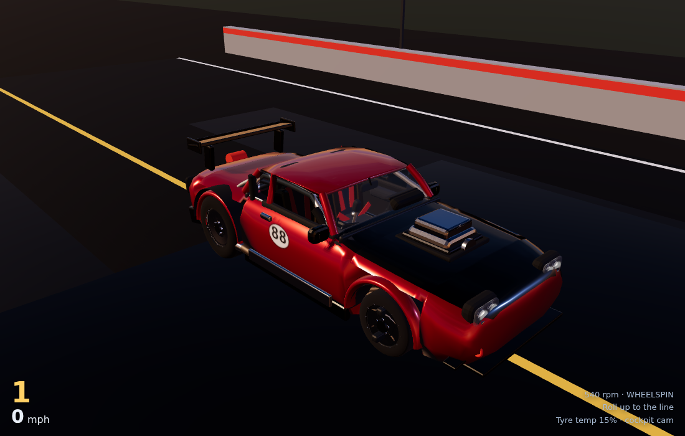

# Nitro Strip

First-person VR drag racing for Meta Quest, built with Three.js and WebXR. The
whole car — exterior and cockpit — is generated in code; there are no modelling
tools involved and no mesh files to load.



## Running it

The site is plain ES modules with a vendored copy of three.js, so there is no
bundler and no build step for development.

```bash
npm install     # only needed for the GLB export and the checks
npm run dev     # http://localhost:8080
```

**On a Quest.** WebXR needs a secure context, so either open the deployed HTTPS
site in the headset browser, or forward the dev server over USB, which counts as
localhost and is therefore trusted:

```bash
adb reverse tcp:8080 tcp:8080
```

Then open `http://localhost:8080` in the Quest browser and press **Enter VR**.

## Controls

| | Quest | Desktop |
|---|---|---|
| Throttle | right trigger | <kbd>W</kbd> / <kbd>↑</kbd> |
| Brake | left trigger | <kbd>S</kbd> / <kbd>↓</kbd> |
| Steer | right thumbstick, **or grab the wheel** with either grip | <kbd>A</kbd> <kbd>D</kbd> |
| Clutch | (automatic) | <kbd>Space</kbd> |
| Shift up / down | **A** / **B** | <kbd>Q</kbd> / <kbd>E</kbd> |
| Line lock (burnout) | left grip | <kbd>Shift</kbd> |
| Parachute | left stick click | <kbd>C</kbd> |
| Reset to the line | **X** | <kbd>R</kbd> |
| Recentre the seat | **Y** | <kbd>H</kbd> |
| Camera / export GLB | — | <kbd>V</kbd> / <kbd>G</kbd> |

Grab steering is the one worth trying: squeeze a grip with your hand near the
rim and the wheel tracks your hand around the column axis, which feels far
better than nudging a thumbstick.

### How to make a good run

1. Roll into the water box behind the line, hold the **line lock** and floor it.
   The rears light up, the tyre temperature climbs and cold slicks turn into
   sticky ones. (There is a tyre-temperature readout on the desktop HUD.)
2. Creep forward until the pre-stage and stage bulbs light on the tree.
3. Hold the brake and the throttle together — the two-step limiter parks the
   engine at 4200 rpm.
4. Release the brake on the last amber. The clutch dumps, the nose lifts, and
   the chassis pitches on the wheelie bars.
5. Pull the chute after the finish line.

The car runs a low nine at about 157 mph if you get the launch right.

## How it is put together

```
src/
  car/
    spec.js        every dimension and drivetrain number, shared with the physics
    geom.js        lofting, tubes, rounded boxes, static merging
    body.js        the exterior: one lofted shell plus details
    interior.js    the cockpit
    wheels.js      tyres, rims, brakes, suspension links
    gauges.js      canvas-drawn instrument faces and the dash screen
    materials.js   the PBR material set
    car.js         assembles the hierarchy and applies simulation state
  physics/vehicle.js   the drag-racing vehicle model
  world/               track, sky/IBL, race director
  input/controls.js    keyboard, gamepad and WebXR controllers
  audio/engine.js      synthesised V8
```

### The car

The body is **lofted**, not built out of boxes. `body.js` lists a table of
cross-sections along the length of the car — underside height, deck height,
half-widths, the height of the widest point, crown — and `loft()` skins them.
That is what gives the panels real curvature: a crowned hood, tumblehome in the
sides, rounded shoulders.

The same loft cuts the openings. Profile segments are dropped where two adjacent
sections agree to drop them, which opens the cabin at the top and the wheel
arches at the sides; arch sections also tuck their lower half inboard so the
tyre sits in a proper well rather than clipping through the bodywork.

Wound the wrong way, a lofted ring renders inside-out. `loft()` checks the
winding of each cross-section and warns, which is how the roof, dash and
transmission tunnel got caught during development.

### Hierarchy and pivots

```
CarRoot                  world position and heading
  PitchPivot             rotates about the rear axle contact line (wheelies)
    Chassis
      Sprung             body and interior: heave, squat, roll
        Exterior / Interior / DriverAnchor
      Suspension_FL      one per corner
        Steer_FL         kingpin yaw (front only)
          Spin_FL        axle rotation
```

Steering wheel, shifter, pedals, instrument needles, blower pulleys, tail lights
and the parachute all keep their own nodes with the pivot in the right place.
Everything that does *not* move is merged down to one mesh per material, because
a standalone headset cares far more about draw calls than triangles — that takes
the car from 431 meshes to 164 at the same 60k triangles.

### Physics

`physics/vehicle.js` is deliberately separate from the model; `applyState()` is
the only bridge and it passes plain numbers. It runs on a fixed 5 ms substep with
a carried remainder, so a run at 30 Hz and the same run at 144 Hz agree to within
a few thousandths of a second (there is a check for exactly this).

It simulates engine inertia against a torque curve, a rev limiter and a two-step,
a friction clutch that actually slips, driven-wheel angular dynamics, a
slip-ratio tyre model with load sensitivity and weight transfer, tyre
temperature, aero drag and downforce, and the parachute.

### The player in VR

The rig hangs off `DriverAnchor` inside the cockpit, so the player rides with the
car while the headset is still free to move their head around inside it. On
entering VR — or on pressing **Y** — the rig is shifted and yawed so that
wherever you are actually sitting or standing lines up with the driver's seat.

## The GLB export

The car can be exported as a normal reusable glTF asset, with the hierarchy,
pivots and separately animatable parts intact.

```bash
npm run export:glb        # writes dist/assets/car.glb
```

Press <kbd>G</kbd> in the browser to do the same thing client-side. The browser
export includes the canvas-generated textures; the headless one skips them (no
DOM) but is otherwise identical. Both go through `GLTFExporter`.

## Deployment

Pushes are built and published to GitHub Pages by
`.github/workflows/deploy.yml`, which vendors three.js, runs the checks, exports
the GLB and uploads `dist/`. Pull requests build and run the checks without
deploying.

**One-time setup:** in the repository settings, under *Pages*, set the source to
**GitHub Actions**. Until that is done the build will succeed and the deploy step
will fail.

Note that the workflow also deploys from `claude/**` branches so the site is
live before anything is merged; drop that trigger once `main` is the source of
truth.

## Checks

```bash
npm run smoke
```

Builds the car and asserts the hierarchy, draw-call and triangle budgets, that it
measures like a car in metres and sits on the ground, and that the driver's eyes
land inside the cockpit. Then it drives the physics through a burnout, a
two-step launch and a full quarter mile and checks the 60 ft, ET and trap speed
land where a car like this would, along with frame-rate independence and that
the parachute slows it down.

## Licence

The vendored three.js in `vendor/` is MIT, © three.js authors.
